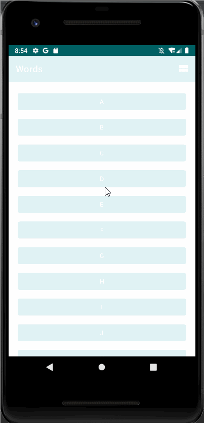

# Developed by Piyusha Gurung, 77261101

## Words Application

It is a word application for Android where users can select a letter and use Intents to navigate to an Activity that presents a number of words starting with that letter. Each word can be looked up via a web search.

## Key Features of Words Application :

1. Use of Implicit and Explicit Intent
2. Scrollable List of 26 letters A to Z in a RecyclerView
3. Switch in orientation of the RecyclerView between a vertical list or a grid of items
4. Search the word on Google

